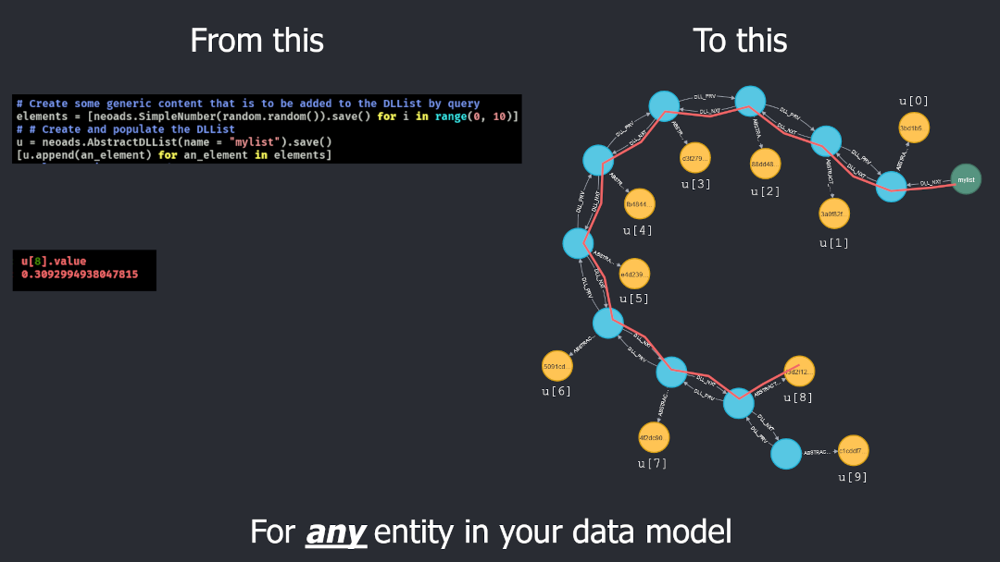

Abstract Data Structures over Neo4J
===================================

The ``neoads`` module implements **interoperable** AbstractSet, AbstractMap and AbstractDLList 
(Doubly Linked List), over a Neo4J backend.

   The ``AbstractDLList`` in action.

It relies on Neomodel for the OGM functionality and is designed to minimise
round-trips to the database. In other words, if an operation can be carried out
at Server Side, ``neoads`` will execute it as a query rather than attempt to
instantiate the data structure in local memory, modify it and then push it
back to the backend.

``neoads`` data structures are implemented in a way that is:

* Agnostic to domain-specific data model
    * You can create lists, sets or maps of *anything* in your data model, 
      simply by making ``ElementDomain`` the root object of your data model.

* Completely transparent to the database backend
    * The abstraction layer does not enforce a special organisation or
      shortcuts and it is still possible to access the data structures in your 
      CYPHER queries.

The main benefit of ``neoads`` is that it makes it possible to store query results in
data structures within the DBMS and feed those data structures to further processing 
**without** re-running the queries themselves.

In addition to classes that model the Set, Map and Doubly Linked Lists, ``neoads``
also introduces a number of other entities such as ``CompositeString`` or ``SimpleDate``
that aim to blur the line between variables held in local RAM and variables held at the 
database management system (Neo4j).

The ultimate goal is to be able to make ``neoads`` data structures completely transparent
from the point of view of a high productivity language such as Python.

This means that ``neoads`` data structures could behave as drop-in replacements for data
processing algorithms and interact "naturally" with other objects via operators and functions.

From this point of view, Neo4J becomes a giant
`heap <https://en.wikipedia.org/wiki/Memory_management#Dynamic_memory_allocation>`_ available 
to higher level algorithms.

Installation
------------
At the moment, it is possible to add ``neoads`` to your ``virtualenv`` directly from
this repository via::

    > pip install git+https://...

``neoads`` relies on `neomodel <https://github.com/neo4j-contrib/neomodel>`_ and assumes
that:

1. A Neo4j instance with proper access rights is already available via a known
   Bolt URL

2. Neomodel's ``db.set_connection()`` has already been called prior to any further calls
   to ``neoads``. (Or more generally, ``neomodel`` has already been initialised).

Quickstart
----------
This section contains the bear minimum usage examples for a user to get up and
running with ``neoads``. 

For more information, please refer to the 
`detailed documentation in ReadTheDocs <https://neoads.readthedocs.io/en/latest/index.html>`_, 
or in ``doc/``.

Working with Simple Variables (Number, Date)
^^^^^^^^^^^^^^^^^^^^^^^^^^^^^^^^^^^^^^^^^^^^

Create a simple variable called ``answer``::

    u = SimpleNumber(42, "answer").save()

``u`` is now a data object that provides full access to the ``SimpleNumber``. To
recall it from the database management system simply use: ::

    v = SimpleNumber.nodes.get(name="answer")

The exact same example applies for ``SimpleDate`` with the exception that the value
argument must be a standard Python ``datetime`` object.

Working with Composite Variables (Strings, Arrays of Strings, Dates, Numbers)
^^^^^^^^^^^^^^^^^^^^^^^^^^^^^^^^^^^^^^^^^^^^^^^^^^^^^^^^^^^^^^^^

Create a string variable called ``greeting``
""""""""""""""""""""""""""""""""""""""""""""
::

    u = CompositeString("Hello World", "greeting").save()

In addition to all other operations that can be applied to ``u``, it is also possible
to access its contents via::

    print(u[2])

Create an Array of strings variable called ``greetings``
""""""""""""""""""""""""""""""""""""""""""""""""""""""""
::

    u = CompositeArrayString(["Hello", "Hola", "Χαίρετε"], "greetings").save()

A similar initialisation pattern applies to `CompositeArrayNumber, CompositeArrayDate`.

Working with Abstract Data Structures (Set, Map, Doubly Linked List)
^^^^^^^^^^^^^^^^^^^^^^^^^^^^^^^^^^^^^^^^^^^^^^^^^^^^^^^^^^^^^^^^^^^^

To work with abstract data structures we need to set up a few things first.
Here are a few strings whose use will become apparent shortly: ::

    colours_a = [CompositeString("RED", "A_RED").save(),
                 CompositeString("GREEN", "A_GREEN").save(),
                 CompositeString("BLUE", "A_BLUE").save()]

    colours_b = [CompositeString("RED", "B_RED").save(),
                 CompositeString("GREEN", "B_GREEN").save(),
                 CompositeString("PURPLE", "B_PURPLE").save()]

Create two sets::

    colours_a_set = AbstractSet(name="A_COLOURS").save()
    colours_b_set = AbstractSet(name="B_COLOURS").save()

Add the items::

    for a_colour in colours_a:
        colours_a_set.add(a_colour)

    for b_colour in colours_b:
        colours_b_set.add(b_colour)

Now, sets can be combined with operators as in::

    union_of_colour_sets = colours_a_set | colours_b_set

Or in more complex ways, such as this way of evaluating the symmetric difference::

    symm_diff_colour = (colours_a_set - colours_b_set) | (colours_b_set-colours_a_set)

It is worth noting that all operators used above **do** produce intermediate objects with
the result of partial evaluations (for example, there are two intermediate sets that are produced
with the partial results needed to evaluate the `__or__`). These can be cleared via
garbage collection.

All of these operations have taken place at **server side**. None of the sets had
to travel to the client side, be processed and then be pushed out to the server
again.

Similarly, it is possible to create `AbstractMap`, `AbstractDLList` objects. For more information
please refer `to the documentation <https://neoads.readthedocs.io/en/latest/index.html>`_.

Abstract data structures over arbitrary data model entities
"""""""""""""""""""""""""""""""""""""""""""""""""""""""""""

``neoads`` is completely agnostic to the sort of entities its abstract data structures point to,
*so long as* these descend from a common ancestor of type ``ElementDomain``.

The following is a minimal example of how to setup lists of persons living in specific geographical
regions. Notice here the way an arbitrary data model gets integrated with ``neoads``. ::

    class PersonalRelationship(neomodel.StructredRel):
        """
        A very simple assocation class between entities of type Person that bears the date the
        acquaintance was made.
        """
        on_date = neomodel.DateTimeProperty(default_now=True)

    class Country(neoads.ElementDomain):
        uid = neomodel.UniqueIdProperty()
        name = neomodel.StringProperty()

    class Person(neoads.ElementDomain):
        uid = neomodel.UniqueIdProperty()
        full_name = neomodel.StringProperty()
        acquainted_with = neomodel.RelationshipTo("Person", "ACQUAINTED_WITH", model = PersonalRelationship)
        lives_in = neomodel.RelationshipTo("Country", "LIVES_IN")

Now, given this data model, we can instantiate a double linked list at server side **just** by running
a simple query::

    # First of all create the list
    some_abstract_list = neoads.AbstractDLList(name="EU_27_PERSONS").save()
    # The populate it
    some_abstract_list.from_query("MATCH (ListItem:Person)-[LIVES_IN]->(b:Country) "
                                  "WHERE b.name IN ['Austria', 'Belgium', 'Bulgaria', 'Croatia', 'Cyprus', 'Czechia', "
                                  "'Denmark', 'Estonia', 'Finland', 'France', 'Germany', 'Greece', 'Hungary', "
                                  "'Ireland', 'Italy', 'Latvia', 'Lithuania', 'Luxembourg', 'Malta', 'Netherlands', "
                                  "'Poland', 'Portugal', 'Romania', 'Slovakia', 'Slovenia', 'Spain', 'Sweden'] ")

At this point, ``some_abstract_list`` will be populated with all ``Person`` that have a connection to
a ``Country`` within the European Union's EU27 countries. This of course was *by name*.

With ``neoads`` it would also have been possible to first create lists of ``Country`` that belong within
a specific geographical region (e.g. Europe, Asia, Americas, etc) and then create a list (still from
a query) that makes use of a previously defined ``neoads`` list.

In addition to this and since ``neoads`` is completely agnostic to the types of elements its abstract
data structures can hold, it is possible to have abstract data structures point to other abstract
data structures creating higher complexity structures if required.

For example a ``neoads`` abstract list of lists can be accessed via ``some_list[0][1]["Alpha"][2]``. The
first indexing returns ``neoads.AbstractDLList`` whose indexing operation returns ``neoads.AbstractDLList``
that in turn returns a ``neoads.AbstractMap`` whose value might be another ``neoads.AbstractDLList``
from which we return the element at index ``2``.

``neoads`` data structures remain completely re-usable at server side.

For more information please see the documentation on abstract data structures.

What happens to unnamed entities? (garbage collection)
""""""""""""""""""""""""""""""""""""""""""""""""""""""
Unnamed entities are saved at the DBMS but unless their ``name`` attribute has been saved (or
they have been renamed) it is impossible for them to be retrieved once a reference to them
has been lost.

This is of course by design, to cover for cases where an intermediate data structure
is required, but is not required to be saved.

For those particular cases, ``neoads`` provides a very simple "garbage collector".
The garbage collector is basically a set of scripts that look for specific variables
and erase them.

These variables are as follows:

1. Variables whose name conforms to a UUID4 identifier and do not have any connection
   with any other entity in the system

2. Data structure entities that are not connected to any data structure

And this brings us nicely to the Memory Manager.

Memory Management
^^^^^^^^^^^^^^^^^
The objective of the memory manager is to group together a number of operations that
might be required for the maintenance of the DBMS state.

At the moment, the only operations that are available via the memory manager are listing objects,
getting a reference to an object and performing garbage collection.

Other operations that are planned are:

1. Lost+Found / recovery operations
2. Optimisation
3. Backup and Restoring

Minimal `MemoryManager` example:
""""""""""""""""""""""""""""""""

`MemoryManager` objects are straightforward to initialise and work with. The following
example assumes that the ``NEO4J_BOLT_URL`` environment variable has already been set. ::

    import random
    import neoads

    mm = neoads.MemoryManager()
    some_elements = [neoads.SimpleNumber(random.random()).save() for k in range(0,10)]
    # Let's perform a dir() on the DBMS for the variables we just set
    objects_in_mem = mm.list_objects()
    # list_objects() returns a dictionary where the key is the name of a variable and value is
    # the object of the variable itself.
    # Let's get a reference to an object
    some_object = mm.get_object(objects_in_mem[0])
    # At this point some_object is of type `SimpleNumber` (or whatever appropriate type) and
    # we can apply any further operations on it.

Documentation
-------------
Module documentation is available in ``doc/`` as a standard sphinx
documentation project or over at `ReadTheDocs <https://neoads.readthedocs.io/en/latest/index.html>`_

